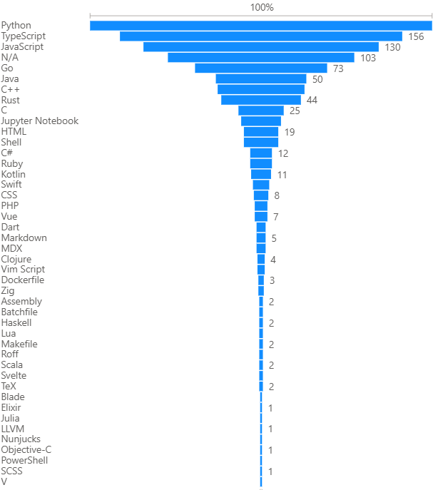

## 📌 Introdução
Neste trabalho, exploramos os **1.000 repositórios mais populares do GitHub** para identificar **padrões e características que definem o sucesso** no cenário atual de desenvolvimento de software.

Respondemos as seguintes **Questões de Pesquisa (RQs)** acompanhadas de métricas e hipóteses:

---

## ❓ Questões de Pesquisa

| RQ | Pergunta | Métrica | Hipótese |
|----|----------|---------|----------|
| **RQ01** | Sistemas populares são maduros/antigos? | Idade do repositório (anos desde a criação) | Repositórios populares tendem a ser mais antigos, pois confiança e base de usuários levam tempo para se consolidar. |
| **RQ02** | Sistemas populares recebem muita contribuição externa? | Total de *pull requests* aceitas | A popularidade atrai uma comunidade engajada, resultando em alto volume de contribuições externas. |
| **RQ03** | Sistemas populares lançam *releases* com frequência? | Total de *releases* | Projetos populares lançam versões frequentes para demonstrar desenvolvimento ativo e entregar valor aos usuários. |
| **RQ04** | Sistemas populares são atualizados com frequência? | Tempo até a última atualização | Repositórios populares se mantêm relevantes e seguros com atualizações constantes. |
| **RQ05** | Sistemas populares são escritos nas linguagens mais populares? | Linguagem primária do repositório | Repositórios populares são majoritariamente desenvolvidos nas linguagens de maior uso no mercado. |
| **RQ06** | Sistemas populares possuem um alto percentual de *issues* fechadas? | Razão entre issues fechadas / total de issues | Projetos populares são bem gerenciados, refletindo em alta porcentagem de *issues* fechadas. |

---

## ⚙️ Metodologia

O arquivo **`repositorios_github.csv`** contém informações sobre os **1.000 repositórios com mais estrelas** no GitHub, incluindo:

- 📅 Data de criação  
- 🔀 Número de *pull requests*  
- 🚀 Total de *releases*  
- 💻 Linguagem primária  
- 🐞 Contagem de *issues* abertas e fechadas  

**Etapas de análise:**

1. **Cálculo da Idade (RQ01):**  
   - Idade = Data de referência (ago/2025) – Data de criação.  
   - Resultado convertido em anos.

2. **Contribuição Externa (RQ02):**  
   - Métrica: coluna **Total Pull Requests**.

3. **Frequência de Releases (RQ03):**  
   - Métrica: coluna **Total Releases**.

4. **Atualizações Recentes (RQ04):**  
   - Métrica: diferença entre a data de última atualização e a data de referência.

5. **Popularidade das Linguagens (RQ05):**  
   - Extração da coluna **Language**.  
   - Contagem das linguagens mais frequentes.  
   - Repositórios sem linguagem definida → **"Não especificado"**.

6. **Percentual de Issues Fechadas (RQ06):**  
   - Fórmula: razão entre número de issues fechadas pelo total de issues  
   - Casos com zero *issues* foram desconsiderados.  
   - Análise feita sobre a **mediana** dos valores.

---

# 📊 Resultados

A análise dos dados resultou nos seguintes valores para cada questão de pesquisa:

---

## 🔹 RQ01: Sistemas populares são maduros/antigos?
A análise da idade dos repositórios revelou que a maioria dos projetos populares possui um tempo considerável de existência.

| Métrica       | Valor   |
|---------------|---------|
| **Mediana da Idade** | 8,35 anos |

---

## 🔹 RQ02: Sistemas populares recebem muita contribuição externa?
O número de contribuições externas, medido pelo total de *pull requests*, apresentou uma grande variação, mas a mediana indica um volume significativo de colaboração.

| Métrica                  | Valor |
|---------------------------|-------|
| **Média de Pull Requests** | 2060   |

---

## 🔹 RQ03: Sistemas populares lançam *releases* com frequência?
A quantidade de *releases* varia bastante entre os projetos, mas a mediana sugere que a prática de versionar e lançar novas versões é comum.

| Métrica              | Valor |
|----------------------|-------|
| **Mediana de Releases** | 36    |

---

## 🔹 RQ05: Sistemas populares são escritos nas linguagens mais populares?
A contagem das linguagens primárias confirmou a dominância de tecnologias consolidadas no desenvolvimento de software.

| Linguagem          | Repositórios |
|--------------------|--------------|
| **Python**         | 189 |
| **TypeScript**     | 156 |
| **JavaScript**     | 130  |
| **Go**             | 73  |
| **Java**           | 50  |
| **C++**            | 48  |
| **Rust**           | 44  |
| **C**          | 25  |
| **Jupyter Notebook**              | 22  |
| **HTML** | 19  |
| **Não especificado** | 103 |

---

## 🔹 RQ06: Sistemas populares possuem um alto percentual de *issues* fechadas?
A análise da proporção de *issues* fechadas em relação ao total de *issues* indica que a maioria dos repositórios populares gerencia ativamente os problemas reportados.

| Métrica                          | Valor   |
|----------------------------------|---------|
| **Mediana da Razão de Issues Fechadas** | 95,7% |

---

## ✅ Conclusão da discussão

Hipóteses confirmadas: RQ01, RQ02, RQ05, RQ06

Hipóteses parcialmente confirmadas: RQ03 e RQ04, onde a frequência de releases e atualizações varia muito entre projetos e pode depender de fatores além da popularidade (ex.: estabilidade, maturidade do código).

Insight geral: Repositórios populares tendem a ser maduros, bem gerenciados, escritos em linguagens consolidadas e recebem participação ativa da comunidade. Entretanto, nem sempre lançam versões com alta frequência, mostrando que qualidade e consistência podem ser mais importantes que quantidade de releases.
